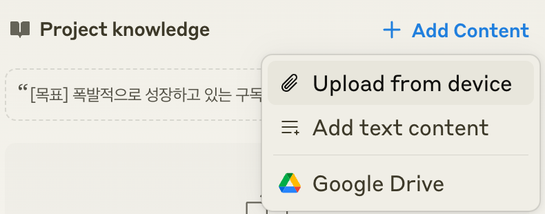
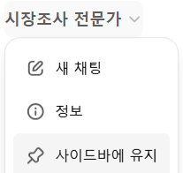
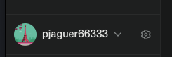
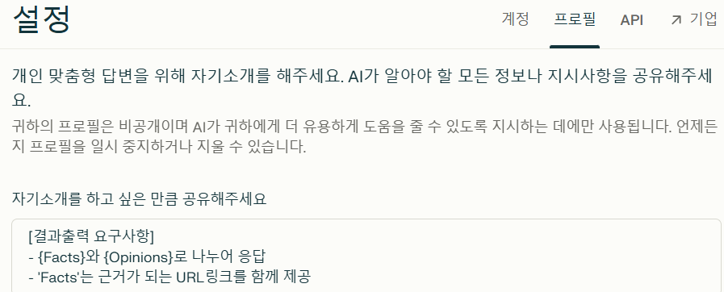
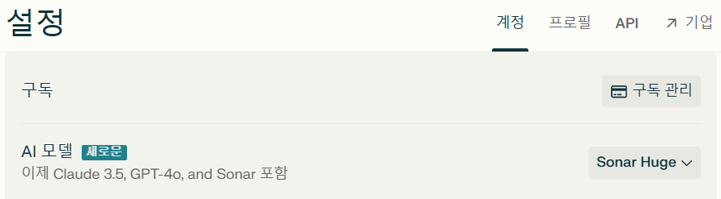
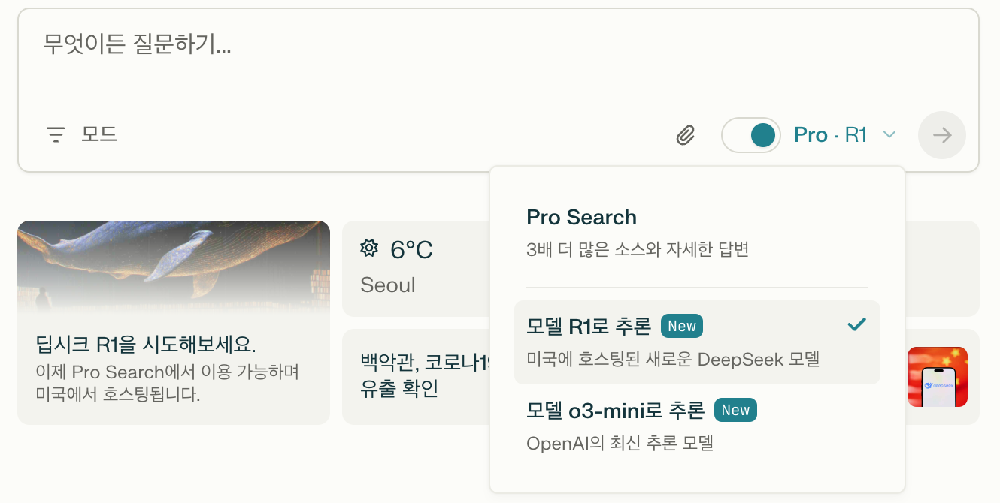
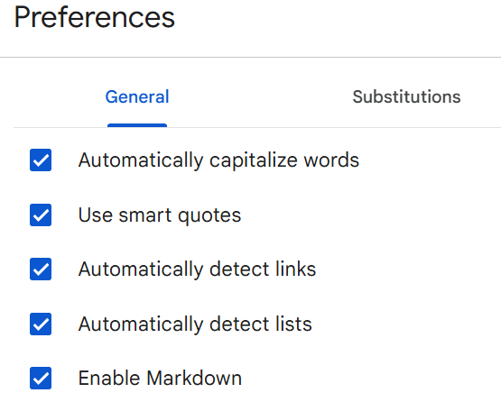
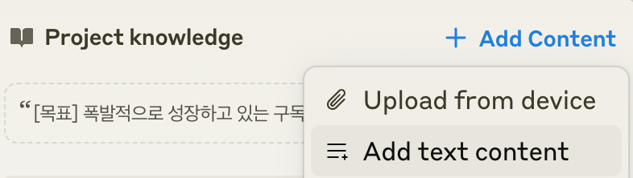
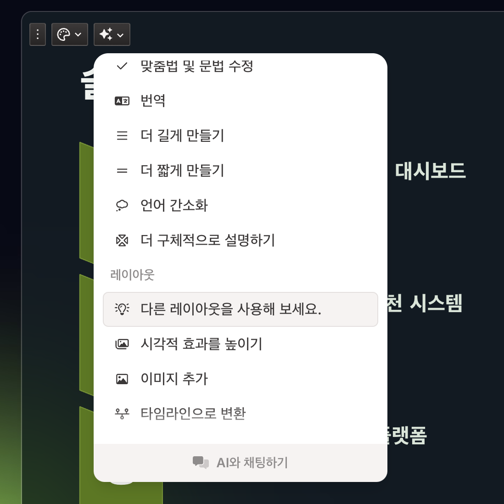

# 생성형AI를 이용한 서비스 기획 실습 가이드

- [생성형AI를 이용한 서비스 기획 실습 가이드](#생성형ai를-이용한-서비스-기획-실습-가이드)
  - [시장 정의](#시장-정의)
  - [생성AI 설정](#생성ai-설정)
    - [Claude 설정](#claude-설정)
    - [ChatGPT](#chatgpt)
    - [Perplexsity 설정](#perplexsity-설정)
    - [Gamma](#gamma)
    - [프롬프팅 기본 정보](#프롬프팅-기본-정보)
  - [문제정의](#문제정의)
    - [시장조사](#시장조사)
    - [관찰](#관찰)
    - [체험](#체험)
    - [고객경험 인터뷰](#고객경험-인터뷰)
    - [문제가설 정의](#문제가설-정의)
    - [문제가설 검증](#문제가설-검증)
    - [문제검증인터뷰 결과 취합](#문제검증인터뷰-결과-취합)
  - [방향성 정의](#방향성-정의)
  - [솔루션 탐색 및 선정](#솔루션-탐색-및-선정)
    - [아이디에이션](#아이디에이션)
    - [우선순위 평가](#우선순위-평가)
    - [솔루션 선정](#솔루션-선정)
  - [비즈니스 모델 기획](#비즈니스-모델-기획)
  - [서비스 기획서 작성](#서비스-기획서-작성)
    - [기획서 스크립트 작성](#기획서-스크립트-작성)
    - [서비스 기획서 작성](#서비스-기획서-작성-1)

---

## 시장 정의
-  전통적 시장 도메인 정의  
   예) 음식배달, 생활 구독관리, AI기반 건강진단 및 예측 

-  고객유형 정의: **JTBD(Jobs To Be Done)** 형태로 정의    
   '사용자군 + 완수하려는 과업'으로 정의.   
  예) 집에서 조리된 음식을 먹고 싶은 음식소비자.  
  예) 가성비 좋은 생활 구독서비스를 이용하고 싶은 구독서비스 이용자.   

## 생성AI 설정

### Claude 설정 
바로가기: [Claude](https://claude.ai/)
- Claude.ai에 Project 생성 
  - 좌측 상단의 Claude로고에 마우스 오버 후 'Projects' 선택  
  - Project 페이지의 우측 상단의 'Create Project' 클릭  
  - 첫번째 항목에 정의한 {시장정의}에 적절한 프로젝트명 입력  
  - 두번째 항목은 비워도 됨   
- 팀원 프로필 생성 
  claude에서 아래 예시와 같은 프롬프트로 요청  
  ```
  {생활 구독관리 서비스} 개발에 필요한 Squad 팀원의 프로필을 작성해 주세요.
  예제와 같이 역할, 이름, 닉네임, 성별, 나이, 성향, 경력을 만들어 주세요.  
  [예시] 
  PO
  - 이름: 갑빠 (남성, 54세)
  - 성향: Value Oriented, Interactive, Iterative를 중시하며 친화적인 성격
  - 경력:
    - IBM에서 5년간 애자일 코치로 근무
    - 네이버, 쿠팡, 카카오에서 PO로 10년간 근무
    - 애자일 컨설팅 회사 창업 및 5년간 운영
    - 국제 애자일 연합회 인증 트레이너
  ```
- Instruction에 목표, 팀 행동원칙, 팀원, 대화 가이드, 최적안 도출 가이드 등 AI와의 협업에 필요한 지침 설정
  
  예시) 
  ```
  [목표]
  폭발적으로 성장하고 있는 생활 구독관리 시장에 대응하기 위한 서비스 개발

  [팀 행동원칙]
  - 'M'사상을 믿고 실천한다. : Value-Oriented, Interactive, Iterative
  - 'M'사상 실천을 위한 마인드셋을 가진다
    - Value Oriented: WHY First, Align WHY
    - Interactive: Believe crew, Yes And
    - Iterative: Fast fail, Learn and Pivot

  [멤버]
  이 프로젝트는 Agentic Workflow 컨셉을 따릅니다.
  아래와 같은 각 멤버가 역할을 나누어 작업합니다. 

  PO (Product Owner)
  - 이름: 오유진 "피오" (여성, 36세)
  - 성향: 구독경제에 대한 깊은 이해와 고객 중심적 사고, 데이터 기반 의사결정 선호
  - 경력:
    - 넷플릭스 코리아 구독서비스 기획 5년
    - 멜론 프로덕트 매니저 3년 
    - 구독경제 컨설팅 회사 운영 2년
    - PSM(Professional Scrum Master) 자격 보유

  Tech Lead
  - 이름: 강동훈 "테키" (남성, 40세)
  - 성향: 안정적인 시스템 구축을 중시하며, 지속적 개선을 추구하는 리더십
  - 경력:
    - 티빙 결제/구독 시스템 개발 리드 6년
    - 마이크로서비스 기반 구독 플랫폼 설계 전문가
    - 네이버 클라우드 기술고문 2년
    - 구독 서비스 아키텍처 컨퍼런스 연사

  UX Designer
  - 이름: 김민지 "유엑스" (여성, 31세)
  - 성향: 사용자 여정 분석에 탁월하며, 심리학적 접근을 활용한 디자인 추구
  - 경력:
    - 쿠팡 구독서비스 UX 디자인 4년
    - 구글 UX 디자인 인증과정 수료
    - 구독서비스 사용성 평가 전문가
    - UX 리서치 방법론 강의 진행

  Backend Developer
  - 이름: 이준혁 "백개" (남성, 34세)
  - 성향: 확장성 있는 시스템 설계를 선호하며, 보안에 대한 높은 관심
  - 경력:
    - 토스 결제시스템 개발 5년
    - 구독 관리 플랫폼 MSA 설계 3년
    - 클라우드 네이티브 개발 전문가
    - 결제/보안 시스템 설계 경험

  Frontend Developer
  - 이름: 박소연 "프개" (여성, 28세)
  - 성향: 모던 웹 기술에 능숙하며, 사용자 경험 최적화에 열정적
  - 경력:
    - 왓챠 프론트엔드 개발자 3년
    - 구독서비스 UI/UX 개발 2년
    - Next.js, React 기반 웹 개발 전문가
    - 프론트엔드 성능 최적화 컨퍼런스 발표

  QA Engineer
  - 이름: 최진우 "큐에이" (남성, 32세)
  - 성향: 체계적인 테스트 설계와 자동화에 강점, 품질 중심적 사고
  - 경력:
    - 라쿠텐 구독서비스 QA 4년
    - 결제 시스템 테스트 자동화 구축 3년
    - ISTQB CTAL 자격증 보유
    - 구독 서비스 품질 관리 프로세스 설계

  DevOps Engineer
  - 이름: 정해린 "데브옵스" (여성, 35세)
  - 성향: 지속적 배포와 모니터링에 탁월, 안정성 중시
  - 경력:
    - 넷플릭스 DevOps 엔지니어 4년
    - 대규모 구독 서비스 인프라 운영 3년
    - 클라우드 네이티브 아키텍처 전문가
    - SRE(Site Reliability Engineering) 컨설턴트
  ---

  [대화 가이드]
  {언어}
  특별한 언급이 없는 경우 한국어를 사용 
  {호칭}
  실명 사용하지 않고 닉네임으로 호칭
  {질문}
  프롬프트가 'q:'로 시작하면 질문을 의미
  - Fact와 Opinion으로 나누어 답변 
  - Fact는 출처 링크를 표시 
  
  {최적안 도출}
  프롬프트가 'o:'로 시작하면 최적안 도출을 의미함
  1) 각자의 생각을 얘기함
  2) 의견을 종합하여 동일한 건 한 개만 남기고 비슷한 건 합침
  3) 최적안 후보 5개를 선정함
  4) 각 최적안 후보 5개에 대해 평가함
  5) 최적안 1개를 선정함
  6) 1) ~ 5)번 과정을 10번 반복함
  7) 최종으로 선정된 최적안을 제시함
  ```

- Knowledge에 협업에 필요한 자료를 업로드   
  좌측에 있는 파일 목록 중 'sample.zip'파일을 다운로드 하고 압축 해제 후 업로드      

  
  - Lean Canvas 작성 가이드
  - sample_관찰 결과보고서.pdf
  - sample_체험 결과보고서.pdf
  - sample_고객경험인터뷰결과지.docx
  - sample_문제가설도출.pdf
  - sample_문제검증인터뷰 결과.docx
  - sample_문제검증인터뷰 결과취합.pdf
- AI 모델은 기본인 'Sonnet' 사용  

### ChatGPT
바로가기: [ChatGPT](https://chatgpt.com/)  
'커리어해커 프롬프트 생성기' 추가 
- 좌측 메뉴에서 'GPT탐색' 클릭  
- 검색창에서 GPT명 검색 
- 상단 타이틀에서 '사이드바에 유지' 클릭  
  

### Perplexsity 설정
바로가기: [Perplexity](https://www.perplexity.ai)  
- 설정 클릭  

- 개인 프로파일에 Facts와 Opinion으로 나누어 답변하도록 설정  
    

  ```
  [결과출력 요구사항]
  - {Facts}와 {Opinions}로 나누어 응답
  - 'Facts'는 근거가 되는 URL링크를 함께 제공 
  ```
- AI 모델은 Sonar Huge나 Claude sonnet 사용 
  

- Search에 Deepseek R1 모델 사용  
  RAG(Retrieval-Augented Generation: 검색 기반 증강 생성 방식) 모델로 **DeepSeek R1**을 사용합니다.   
  

### Gamma 
바로가기: [Gamma](https://gamma.app)

### 프롬프팅 기본 정보  

- 표준 프롬프트 형식
  ```
  [요청사항] 
  - {고객유형} {대상자수}명을 관찰한 결과를 개별적으로 작성해 주세요.
  [참고자료]
  - {자료1}
  - {자료2}
  [결과형식] 
  결과형식에는 문단형식, 코드블록, 마크다운 표 등이 있음  
  ```

> Tip: 마크다운 표를 문서에 붙이는 방법  
> - 응답의 'Copy'버튼을 눌러 내용 복사  
> - Google docs 임시문서를 생성  
> - 도구 > Preference 클릭 후 'Enable Markdown' 체크  
>   
> - Edit > Paste from markdown 수행  
> - 표 형태로 나온 결과를 복사하여 원하는 문서에 활용  

> Tip: 프롬프트에서 줄바꿈은 **SHIFT-Enter키**를 사용해야 함  

---

## 문제정의
### 시장조사
- '커리어해커 프로프트 생성기'에게 시장조사 프롬프트 요청.  
- 프롬프트:
  ```  
  [요청사항] 
  - {생활 구독관리 서비스}에 대한 시장조사 프롬프트
  - 프롬프트 내용은 한국어로 작성
  [결과형식] 
  코드블록 
  ```
- ChatGPTs의 Perplexisity를 이용하여 시장 조사  
  - 위에서 구한 프롬프트를 이용  
  - 결과를 복사하여 Knowledge에 '시장조사' 제목으로 업로드: 'Add text content' 메뉴 이용    
    

### 관찰 
- 'sample_관찰결과 보고서.xlsx'의 컬럼을 상황에 맞게 수정. AI에게 적절한 컬럼을 정의하라고 할 수도 있음. 
- 수정한 샘플을 pdf로 변환하여 knowledge에 업로드  
- 프롬프트 예시
  ```
  [요청사항]
  - {가성비 좋은 생활 구독서비스를 이용하고 싶은 구독서비스 이용자} {10}명을 관찰한 결과를 개별적으로 작성해 주세요.
  - 프로필에 연령대를 포함  
  [참고자료]
  - sample_관찰결과 레포트  
  [결과형식]
  - 마크다운 표
  ```
- 결과를 복사하여 Knowledge에 '관찰결과'로 업로드  
  
### 체험
- 'sample_체험결과 보고서.xlsx'의 컬럼을 상황에 맞게 수정. AI에게 적절한 컬럼을 정의하라고 할 수도 있음. 
- 수정한 샘플을 pdf로 변환하여 knowledge에 업로드  
- 프롬프트 예시
  ```
  [요청사항]
  - {가성비 좋은 생활 구독서비스를 이용하고 싶은 구독서비스 이용자} {10명}의 체험일지를 작성해 주세요.
  [참고자료]
  - sample_체험결과 레포트  
  [결과형식]
  - 마크다운 표
  ```
- 결과를 복사하여 Knowledge에 '체험결과'로 업로드   
  
### 고객경험 인터뷰
- 'sample_고격경험인터뷰 결과지.docx'을 knowledge에 업로드  
- 프롬프트 예시
  ```
  [요청사항]
  - {가성비 좋은 생활 구독서비스를 이용하고 싶은 구독서비스 이용자} {10}명을 대상으로 고객경험인터뷰 결과를 개별적으로 작성해 주세요.
  - 고객 경험 단계: 주문, 배달, 평가 또는 후기로 함
  - 각 단계에서의 행동, 생각, 긍정적 느낌, 부정적 느낌으로 섹션을 나누어 작성 
  [참고자료]
  - sample_고객경험인터뷰 결과지.docx
  [결과형식]
  - 문단형식
  ```
  > Tip: 답변이 중단되면 '계속요'라고 요청  

- 결과를 복사하여 Knowledge에 '고객경험인터뷰 결과'로 업로드  
  
### 문제가설 정의
- 프롬프트  
```
[요청사항]
- 현상문제를 도출하고 5WHY기법으로 근본문제를 도출해 주세요.
- {현상문제|WHY1|WHY2|WHY3|WHY4|WHY5|근본원인}형식으로 작성해 주세요.   
- 각 자 생각을 한꺼번에 응답  
[참고자료]
- 시장조사
- 관찰결과
- 체험결과
- 고객경험인터뷰 결과 
- sample_문제가설도출.pdf
[결과형식]
- 마크다운 표  
```
- 문제가설 3개를 근본원인과 함께 도출  
```
o:문제가설 3개를 근본원인을 포함하여 도출합시다. 
```
- 결과를 Knowledge에 '문제가설'이라는 제목으로 업로드  
  
### 문제가설 검증 
- 'sample_문제검증인터뷰 결과.docx'를 Knowledge에 업로드   
- 프롬프트 예시  
```
[요청사항]
- 10명에 대한 문제검증인터뷰 결과를 개별적으로 "생략하지 말고 모두 제공"해 주세요.   
- 각 개별 인터뷰 결과에 문제 가설 3개의 중요도와 불편도를 5점 만점으로 평가한 결과 포함  
- 인터뷰 결과지만 제공하고 종합 분석은 하지 말것       
[참고자료]
- 문제가설
- sample_문제검증인터뷰 결과.docx
[결과형식]
- 문단형식  
```  
- 결과를 Knowledge에 '문제검증인터뷰 결과'로 업로드  
  
### 문제검증인터뷰 결과 취합  
- 'sample_문제검증인터뷰 결과취합.xlsx'를 pdf로 변환하여 Knowledge에 업로드  
- 위 단계 수행결과 결과 '문제검증인터뷰 결과.docx'를 Knowledge에 업로드 
- 프롬프트 예시  
```
[요청사항]
- 첨부한 문제검증인터뷰 결과를 'sample_문제검증인터뷰 결과취합'처럼 취합해 주세요.     
[참고자료]
- 문제검증인터뷰 결과
- sample_문제검증인터뷰 결과취합.pdf
[결과형식]
- 마크다운 표
```  
- '문제검증인터뷰 결과취합'이라는 제목으로 Knowledge에 업로드 합니다.  

---

## 방향성 정의
- 프롬프트 예시
  ```
  [요청사항]
  문제를 해결하기 위한 문제해결 방향성을 정의하고자 합니다.
  문제해결 방향성은 Needs Statement로 정의합니다. 

  [참고자료]
  - 체험결과
  - 관찰결과
  - 고객경험인터뷰 결과
  - 문제가설
  - 문제검증인터뷰 결과
  - 문제검증인터뷰 결과취합
  [Needs Statement]
  * '<사용자>는 <목적>을 위하여 <원하는 것>이 필요하다.' 형식으로 작성
  * 사용자의 입장에서 사용자의 경험이 어떤 방향으로 향상되면 문제를 해결하거나 완화할 수 있는지를 표현
  * 여러개를 만드는 것이 아니라 1개의 문장으로 표현
  * 기능이 아니라 사용자의 경험의 향상이 표현되어야 함
  [결과형식]
  문단형식
  ```
- 토의를 통해 정의된 방향성 도출 결과를 '문제해결 방향성'으로 Knowdlege에 업로드   

---

## 솔루션 탐색 및 선정
### 아이디에이션 
- 발산 프롬프트 예시
  ```
  [요청사항]
  '문제해결 방향성'에 맞게 Big Idea 3개, Little Win Idea 2개, Crazy Idea 1개를 각 자 만들어 주세요. 
  [아이디어 구분]  
  - Big Idea: 인력과 비용은 많이 드나 실현되면 비즈니스 기여도가 높은 아이디어  
  - Little Win Idea: 실현가능성이 높은 아이디어  
  - Crazy Idea: 절대 불가능할 것 같지만 실현되면 비즈니스 기여도가 가장 높은 아이디어 
  [참고자료]  
  - 체험결과
  - 관찰결과
  - 고객경험인터뷰 결과
  - 문제가설
  - 문제검증인터뷰 결과
  - 문제검증인터뷰 결과취합
  - 문제해결 방향성 
  [결과형식]
  마크다운 표
  ```
- 수렴 프롬프트 예시
  ```
  [요청사항]
  - {최적화 가이드}에 따라 유사하거나 동일한 것은 합쳐서 정리를 해주세요.
  - 컬럼: 아이디어번호, 아이디어 구분, 아이디어 제목, 아이디어 설명 
  - 아이디어 설명은 최대한 자세히 표현해 주세요.
  [결과형식]
  마크다운 표
  ``` 
### 우선순위 평가
- 프롬프트 예시
  ```
  [요청사항]
  - 각 자 비즈니스가 높은 아이디어와 실현 가능성이 높은 아이디어에 투표해 주세요.  
  - 비즈니스 가치가 높은 아이디어는 B(Business), 실현 가능성이 높은 아이디어는 F(Feasibility)로 표시  
  - 컬럼: 아이디어 제목, 비즈니스 가치, 실현 가능성  
  - 비즈니스 가치와 실현 가능성에 받은 투표수를 합산하여 표시 
  [결과형식]
  마크다운 표
  ``` 

### 솔루션 선정 
- 우선순위 평가 그래프를 작성함   
  ```
  [요청사항]
  - 평가결과를 '우선순위 평가 매트릭스'로 작성
  - X축은 실현가능성(낮음에서 높음), Y축은 비즈니스 영향도(낮음에서 높음)
  - 아래와 같이 4개의 영역으로 표시
    - No Brain: 실현가능성 높음, 비즈니스 영향도 높음
    - Bit Bets: 실현가능성 낮음, 비즈니스 영향도 높음
    - Utilities: 실현가능성 높음, 비즈니스 영향도 낮음
    - Unwise: 실현가능성 낮음, 비즈니스 영향도 낮음   
  - 아이디어명 표시
  ``` 

  > Tip: 그래프 복사하기 
  > - 그래프 하단의 'Publish' 클릭  
  > - Publish창에서 'Copy Link'를 클릭한 후 새 탭에 붙여넣기 함  
  
- 선정된 아이디어를 '핵심솔루션'이라는 제목으로 Knowledge에 업로드 
  ```
  [요청사항]
  - 아래 핵심솔루션을 표 형식으로 정리
    - 통합 구독 관리 인프라
    - 스마트 구독 결제 시스템
  - 컬럼: 아이디어 제목, 설명, 비즈니스 가치, 실현 가능성  
  [결과형식]
  마크다운 표
  ```
---

## 비즈니스 모델 기획  
- Lean Canvas 작성 가이드를 Knowledge에 업로드 
- 프롬프트 예제
  ```
  [요청사항]
  린캔버스를 이용하여 비즈니스 모델을 기획합시다.
  참고자료를 바탕으로 'Lean Canvas 작성 가이드'에 따라 작성해 주십시오.
  [참고자료]
  - 고객유형: 가성비 좋은 생활 구독서비스를 이용하고 싶은 구독서비스 이용자
  - 문제검증인터뷰 결과취합
  - 문제해결 방향성
  - 핵심솔루션 
  - Lean Canvas 작성 가이드
  [결과형식]
  문단형식 
  ```

---

## 서비스 기획서 작성
### 기획서 스크립트 작성  
- 린캔버스 내용을 기반으로 각 장표를 텍스트로 작성
- 좌측 메뉴에 있는 'sample_서비스기획서 스크립트' 참조  

### 서비스 기획서 작성
gamma.app을 이용하여 빠르게 작성
- gamma.app 로그인
- '새로만들기' 클릭
- 텍스트로 붙여넣기 선택
- 위에 작성한 텍스트 붙여넣기 하고 하단의 '계속' 클릭
- 좌측에서 텍스트 콘텐츠를 '보존'으로 선택: 원래 텍스트를 최대한 보존하는 옵션  
- 중앙 하단에서 페이지 수 설정: 10~15장 정도 적당
- '계속' 클릭
- 우측에서 테마 선택하고 상단의 '생성' 클릭
- 각 페이지를 다듬어서 완성함

> Tip: 페이지 레이아웃 편집: 다른 레이아웃, 시각적 효과 높이기, 이미지 추가, 타임라인으로 변환   
  

